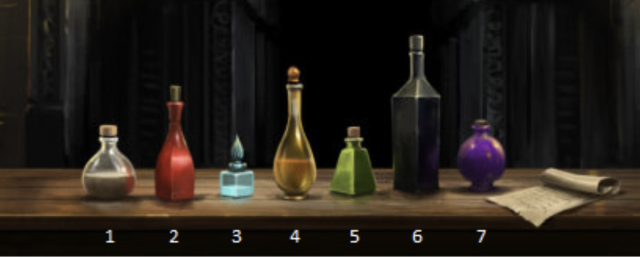

# Seven Potions

* Danger lies before you, while safety lies behind,
* Two of us will help you, whichever you would find,
* One among us seven will let you move ahead,
* Another will transport the drinker back instead,
* Two among our number hold only nettle wine,
* Three of us are killers, waiting hidden in line.
* Choose, unless you wish to stay here for evermore,
* To help you in your choice, we give you these clues four:
* First, however slyly the poison tries to hide
* You will always find some on nettle wine's left side;
* Second, different are those who stand at either end,
* But if you would move onwards, neither is your friend;
* Third, as you see clearly, all are different size,
* Neither dwarf nor giant holds death in their insides;
* Fourth, the second left and the second on the right
* Are twins once you taste them, though different at first sight.
